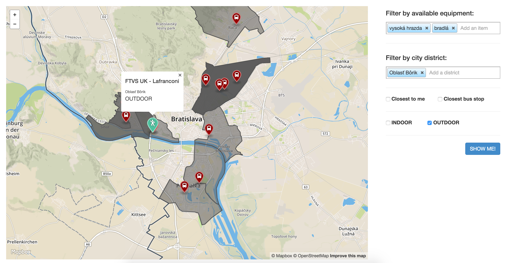

# Overview

The application displays public street workout places in Bratislava city:
- find the place closest to your position
- find the place closest to any bus stop
- filter places by equipment available
- filter places by city district
- filter places by indoor/outdoor placement

Sample screenshot:



The application has 2 separate parts:
- the client which is a [AngularJS web application](#frontend) using mapbox API and mapbox.js
- the [backend application](#backend) written in [ExpressJS](http://expressjs.com/), communicating with PostGIS via [Postgeo plugin](https://www.npmjs.com/package/postgeo).
The frontend application communicates with backend using a [REST API](#api).

# Setup

- install and run Docker container mdillon//postgis (docker run -p 5432:5432 -d mdillon/postgis)
- connect to database `postgres` and run SQL commands from `/data/load.sql`
- download OSM data for Bratislava city and import them into mentioned database (osm2pgsql -H 192.168.99.100 -P 5432 -s -U postgres -d postgres data/Bratislava.osm)
- go to application root (cd app) and run API server (node app.js) that will be listening on port 3000

# Frontend

The frontend application consists of HTML page `/app/index.html` and AngularJS module `/app/angularApp.js` which shows map using mapbox.js widget and communicates with backend via AJAX calls. Map displays public workout places in Bratislava city.

# Backend

The backend application is written in ExpressJS (application server for NodeJS) and it's just simple API endpoint querying data from PostgreSQL database using postgeo plugin and returning them in GeoJSON format. Module can be found at `/app/app.js`.

## Data

Application uses direct access to MapBox API for map rendering. Only other data sources are:
- public workout location data created via Google My Maps, exported in KML format and transformed into Postgis queries
- OSM export of portion of Bratislava city

## Api

**API accepts queries via POST in JSON format. Only query parameters are current user's geolocation (longitude, latitude)**

### Response

API returns `geojson` which contains geometry and properties for each finded workout place. Properties that are later used in interface are:
- equipment list
- city district to which certain place belongs
- distance from current user's geolocation
- distance from closest bus stop
- INDOOR/OUTDOOR flag

Sample record:

```
{
  "fillColor": "#FF00FF",
  "weight": "20",
    "color": "#FF00FF",
    "fillOpacity": 0.8,
    "title": "Billa",
    "distance": "329 metres away",
    "area": "400",
    "from": "Saratovská",
    "description": "234 metres away, area of shop: 400 m<sup>2</sup>"
}
```